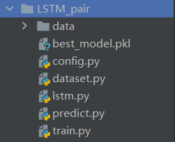

### 基于LSTM的春联下联预测

#### 一、项目介绍

​	本项目旨在通过 LSTM 模型实现春联的下联预测。要理解本项目，必须理解pytorch、torchnet等模块函数的使用方式及机理。同时，各变量的维度也是我们必须要明确的部分。

​	项目代码结构：

- config.py：存放项目参数
- dataset.py：初始化训练数据
- lstm.py：模型定义
- predict.py：模型预测
- train.py：模型训练



#### 二、数据集介绍

- train_in.txt：训练集上联，每行都是一个输入，每个词之间使用空格隔开。
- train_out.txt：训练集下联，每行都是一个输出，对应着train_in.txt的每行。每个词都使用空格隔开
- test_in.txt：测试集上联，每行都是一个输入，每个词之间使用空格隔开。
- test_out.txt：测试集下联，每行都是一个输出，对应着train_in.txt的每行。每个词都使用空格隔开
- vocabs：词汇文件

#### 三、模型介绍

模型主要为LSTM，包括了三个组件，分别是Embedding层、LSTM层和线性全连接层。

- Embedding层：生成每个词对应的 **嵌入向量**
- LSTM层：提取语句中的语义信息
- Linear层：将每条结果映射为vocab_size大小的输出，即每个字的概率。

模型参数：

```python
# 模型输入参数
input_path = './data/train_in.txt'
output_path = './data/train_out.txt'
num_layers = 1  # LSTM层数
hidden_dim = 100    # LSTM隐藏层大小
epochs = 50 # 迭代次数
batch_size = 128    # 批处理大小
embedding_dim = 15  # embedding向量大小
lr = 0.01   # 模型学习率
device = 'cuda:0'   # 训练设备
```

##### 3.1 模型初始化

```python
class LSTM(nn.Module):
    def __init__(self, vocab_size, embedding_dim, hidden_dim, num_layers):
        """
        :param vocab_size: 词典大小
        :param embedding_dim: 词嵌入大小
        :param hidden_dim: 隐藏层大小
        :param num_layers: 隐藏层层数
        """
        super(LSTM, self).__init__()
        self.hidden_dim = hidden_dim
        # nn.Embedding: 随机初始化向量，词向量在N(0,1)正态分布中随机取值
        # 输入: 词典大小，嵌入向量的维度
        # 输出：[规整后句子长度, batch_size, 词向量维度]
        self.embeddings = nn.Embedding(vocab_size + 1, embedding_dim)
        # lstm层
        self.lstm = nn.LSTM(embedding_dim, hidden_dim, num_layers)
        # 线形层
        self.linear = nn.Linear(hidden_dim, vocab_size)
```

###### 3.1.1 nn.Embedding

**简介：**

- 可以理解为字典，存储大小字典的词嵌入。
- 此模块通常用于存储单词嵌入并使用索引检索它们(类似数组)。模块的输入是一个索引列表，输出是相应的词嵌入。

**参数：**

- num_embeddings：字典大小
- embedding_dim：每个词向量维度

**使用：**

```
>>> # an Embedding module containing 10 tensors of size 3
>>> embedding = nn.Embedding(10, 3)
>>> # a batch of 2 samples of 4 indices each
>>> input = torch.LongTensor([[1,2,4,5],[4,3,2,9]])
>>> embedding(input)
>>> # 生成了2句话所有词的词嵌入向量
>>> (seq_length, batch_size,  embedding_dim)
tensor([[[-0.0251, -1.6902,  0.7172],
         [-0.6431,  0.0748,  0.6969],
         [ 1.4970,  1.3448, -0.9685],
         [-0.3677, -2.7265, -0.1685]],

        [[ 1.4970,  1.3448, -0.9685],
         [ 0.4362, -0.4004,  0.9400],
         [-0.6431,  0.0748,  0.6969],
         [ 0.9124, -2.3616,  1.1151]]])
```

###### 3.1.2 nn.LSTM

**参数：**

- embedding_dim：词嵌入维度
- hidden_dim：隐藏层大小
- num_layers：隐藏层维度

###### 3.1.3 nn.Linear

- hidden_dim：输入维度为LSTM的隐藏层大小
- vocab_size：输出维度为词典大小

##### 3.2 模型前向传播

```python
class LSTM(nn.Module):
    def forward(self, x):
    """
    :param x: 输入批向量 (time_step(序列长度),batch_size)
    :return:输出所有数据 (batch_size * time_step, vocab_size)
    """
        # x: (seq_length, batch_size)
        time_step, batch_size = x.size()
        embeds = self.embeddings(x)
        # embeds: (序列长度, batch_size, embedding_dim)
        output, (h_n, c_n) = self.lstm(embeds)
        # output: (序列长度, batch_size, hidden_dim)
        # 返回所有时间点的数据，每个时间点对应一个字，也就是vocab_size维度的向量
        # output.reshape(time_step * batch_size,-1): (batch_size * time_step, hidden_dim)
        y_ = self.linear(output.reshape(time_step * batch_size, -1))
        # y_: (batch_size * time_step, vocab_size)
        return y_
```

数据传递过程：

1.  x：输入数据的批向量，(seq_length, batch_size)
2. embeds：注入了embedding之后的数据，(seq_length, batch_size, embedding_dim)
3. output：数据经过 LSTM(embedding_dim -> hidden_dim) 网络后的输出，(seq_length, batch_size, hidden_dim)
4. y_：全连接层(hidden_dim -> vocab_size)的输出，(batch_size * time_step, vocab_size)

#### 四、数据处理

##### 4.1 读取数据

```python
# 数据读取和切分
def read_data(file_path):
    lines = codecs.open(file_path, encoding='utf-8').readlines()
    # strip: 删除字符串前后的多余空格, split(' '):转化为list，以' '为分割
    txt = [line.strip().split(' ') for line in lines]
    # 过滤掉过长的字符串
    out = [line for line in txt if len(line) < 16]
    return out
```

##### 4.2 构建数据字典

{ 1 : [长度为1的上联，长度为1的下联], 2:   [长度为2的上联，长度为2的下联], 3: ...}

```python
def generate_count_dict(result_dict, x, y):
    for i, idx in enumerate(x):
        j = len(idx)
        if j not in result_dict:
            result_dict[j] = [[], []]
        result_dict[j][0].append(idx)
        result_dict[j][1].append(y[i])
    return result_dict
```

##### 4.3 转化为ndarray

```python
# 将字典转化为numpy
def to_numpy_array(dict):
    for count, [x, y] in dict.items():
        dict[count][0] = np.array(x)
        dict[count][1] = np.array(y)
    return dict
```

##### 4.4 数据预处理

```python
def load_data(input_path, output_path):
    x = read_data(input_path)
    y = read_data(output_path)
    # 全部词表
    vocabulary = x + y
    # 构造字符级别的特征
    string = ''
    for words in vocabulary:
        for word in words:
            string += word
    # 所有词汇表,所有字的集合(去除了重复的字)
    vocabulary = set(string)

    # 构建索引
	word2idx = {word: i for i, word in enumerate(vocabulary)}
	idx2word = {i: word for i, word in enumerate(vocabulary)}

    # 词的个数,词汇表大小
 	vocab_size = len(word2idx.keys())

    # 将x和y转化为索引
    x = [[word2idx[word] for word in sent] for sent in x]
    y = [[word2idx[word] for word in sent] for sent in y]

    train_dict = {}
    train_dict = generate_count_dict(train_dict, x, y)
    train_dict = to_numpy_array(train_dict)
	return train_dict, vocab_size, idx2word, word2idx
```

##### 4.5 生成训练数据

​	根据数据字典，获得不同句子长度的训练数据

```python
def data_generator(data):
    """
    :param data: train_dict-{ 1 : [长度为1的上联，长度为1的下联], 2:   [长度为2的上联，长度为2的下联], 3: ...}
    :return: (batch_size, seq_len),(batch_size, seq_len, 1)
    """
    # 计算每个长度对联相应的权重
    # 统计各长度对应的对联个数
    data_nums = [float(len(x)) for num, [x, y] in data.items()]
    # 各长度字数的权重
    data_probability = np.array(data_nums) / sum(data_nums)

    # 随机选择长度不同的对联，生成batch
    for idx in range(15):
        idx = idx + 1

        # batch_size 与 长为x_len的对联数量 之间的最小值
        x_num = len(data[idx][0])
        size = min(batch_size, x_num)

        # 随机选择size个在[0,x_num)区间的数
        idxs = np.random.choice(x_num, size=size, replace=False)
        # print("idxs: ", idxs)
        # 返回选出的上联x 与 下联y，将原本array拓展为(row,col,1)
        # expand_dims: 拓展维度
        yield data[idx][0][idxs], np.expand_dims(data[idx][1][idxs], axis=2)
        # 返回的数据：(batch_size, seq_len),(batch_size, seq_len, 1)
```

#### 五、模型训练

##### 5.1 训练模块初始化

```python
from dataset import *
from config import *
from lstm import LSTM
import torch
from torch import nn
from torch import optim
from torchnet import meter

# 加载数据
train_dict, vocab_size, idx2word, word2idx = load_data(input_path=input_path, output_path=output_path)

# 初始化模型
model = LSTM(vocab_size=vocab_size, hidden_dim=hidden_dim,
             embedding_dim=embedding_dim, num_layers=num_layers)

# 创建优化器
optimizer = optim.Adam(model.parameters(), lr=lr)
# 定义损失函数
criterion = nn.CrossEntropyLoss()
model.to(device)

# 计算[0]均值和[1]标准差
loss_meter = meter.AverageValueMeter()
# loss参数
best_loss = 999
# 保存对应最好准确率的模型参数
best_model = None
```

##### 5.2 训练模型

```python
# 开始训练
for epoch in range(epochs):
    # 训练模型
    model.train()
    # 用来计算
    loss_meter.reset()

    for x, y in data_generator(train_dict):
        # x 在transpose之前的维度: (batch_size, 序列长度)
        # transpose(1,0)，将矩阵x,y轴调转。目的：将x
        # 断开新x与旧x之间的依赖，深拷贝
        # print("x: ", x.shape)
        # print("y: ", y.shape)
        x = torch.from_numpy(x).long().transpose(1, 0).contiguous()
        x = x.to(device)
        y = torch.from_numpy(y).long().transpose(1, 0).contiguous()
        y = y.to(device)

        optimizer.zero_grad()
        # 前向传播
        # x:(seq_len, batch_size)
        output_ = model(x)
       
        # 计算损失
        # view(-1)，将所有数调整为一维的
        # output_: (batch_size * seq_length, vocab_size)
        # y,long.view(-1): (batch_size * seq_length)
        # one-hot编码方式进行损失计算，y.long.view(-1)的值表示了每个字的在字典中的索引
        loss = criterion(output_, y.long().view(-1))
        # 反向传播
        loss.backward()
        optimizer.step()
        loss_meter.add(loss.item())

    # 打印
    print("[Epoch: ] %s" % str(epoch + 1))
    print("Loss: %s" % (str(loss_meter.mean)))

    # 更新最优模型
    if loss_meter.mean < best_loss:
        best_loss = loss_meter.mean
        best_model = model.state_dict()

    # 在训练结束时保留最优参数模型
    if epoch == epochs - 1:
        torch.save(best_model, './best_model.pkl')
print("finished")
```

#### 六、模型预测

```python
import torch
from dataset import *
from lstm import LSTM
from config import *

_, vocab_size, idx2word, word2idx = load_data(input_path, output_path)


def predict(s):
    # 将字符串转化为编码
    x = [word2idx[word] for word in s]
    # x: (1,seq_length)
    # 讲list转化为tensor
    x = torch.from_numpy(np.array(x).reshape(-1, 1))
    # x: (seq_length, 1)

    # 加载模型
    model_path = './best_model.pkl'
    model = LSTM(vocab_size=vocab_size, hidden_dim=hidden_dim,
                 embedding_dim=embedding_dim, num_layers=num_layers)

    model.load_state_dict(torch.load(model_path, 'cpu'))

    y = model(x.long())
    # 取每一行最大列的列标
    # 当axis=0，是在列中比较，选出最大的 行 索引
    # 当axis=1，是在行中比较，选出最大的 列 索引
    y = y.argmax(axis=1)
    # print("y: ", y)
    r = ''.join([idx2word[idx.item()] for idx in y])
    print('上联：%s， 下联：%s' % (s, r))

sentence = '恭喜发财'
predict(sentence)
```